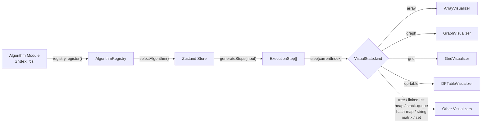
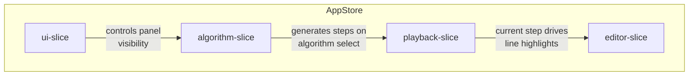

[← Back to README](../README.md)

# Architecture

AlgoFlow uses a **registry-driven** architecture with **pre-computed execution steps**.

## Tech Stack

| Layer       | Technology                             | Purpose                                       |
| ----------- | -------------------------------------- | --------------------------------------------- |
| Framework   | Vite + React 19 + TypeScript (strict)  | Build tooling, UI, type safety                |
| Styling     | Tailwind CSS v4                        | Black-first theme (zinc-950/zinc-900)         |
| State       | Zustand (4 slices + immer)             | Global state management                       |
| Code Editor | Monaco Editor                          | Read-only code display with line highlighting |
| Layout      | react-resizable-panels                 | 3-panel IDE layout on desktop                 |
| Animation   | Framer Motion                          | Bar swaps, grid waves, spring transitions     |
| Testing     | Vitest + Testing Library + Storybook 8 | Unit, visual, and integration testing         |

## Data Flow



## Core Pattern

1. Each algorithm **self-registers** via `registry.register(definition)` at import time
2. `generateSteps(input)` produces a full `ExecutionStep[]` array eagerly
3. **Playback is an index pointer** into the step array — instant scrubbing, deterministic replay
4. Category-specific **trackers** build steps with correct visual state and per-language line mappings
5. A **discriminated union** on `VisualState.kind` dispatches to the matching visualizer component

> [!NOTE]
> All UI components are generic — no algorithm-specific logic in the view layer. Adding a new algorithm requires zero changes to any component.

### Trackers

Each algorithm category has a dedicated tracker that extends `BaseTracker`. Trackers provide domain-specific methods (e.g., `compare`, `swap` for sorting) that internally call `pushStep()` to record an `ExecutionStep` with the correct visual state.

See [contributing.md](contributing.md#available-trackers) for the full tracker table with methods per category.

### Source Files & Line Mapping

Algorithm source files (`sources/*.ts`, `*.py`, `*.java`) serve a dual purpose through custom Vite plugins:

| Import Suffix | What You Get                                            | Use For                       |
| ------------- | ------------------------------------------------------- | ----------------------------- |
| `?raw`        | Raw string with `@step:` markers intact                 | Monaco code display           |
| `?fn`         | Executable ESM module (markers stripped, TS transpiled) | Algorithm execution and tests |

The `@step:` annotation system enables synchronized line highlighting across languages. See the [full annotation guide](contributing.md#the-step-annotation-system) in the contributing docs.

## State Management

Zustand with 4 slices merged into a single `AppStore`, using immer middleware for immutable updates:

| Slice         | Owns                                              | Key Actions                                                |
| ------------- | ------------------------------------------------- | ---------------------------------------------------------- |
| **algorithm** | Selected algorithm, input data, grid state        | `selectAlgorithm`, `updateInput`, `updateGrid`             |
| **playback**  | Current step index, play/pause, speed, step array | `play`, `pause`, `stepForward`, `stepBackward`, `setSpeed` |
| **editor**    | Monaco editor ref, selected language              | `setLanguage`, `setEditorRef`                              |
| **UI**        | Drawer visibility, panel sizes, mobile tab        | `toggleDrawer`, `setActiveTab`                             |



Access state in components via:

```typescript
const isPlaying = useAppStore((state) => state.isPlaying);
const selectAlgorithm = useAppStore((state) => state.selectAlgorithm);
```

## Responsive Design

- **Desktop** (>=1024px): 3-panel resizable layout with code, visualization, and explanation panels side by side
- **Mobile/Tablet** (<1024px): Tab-based single-panel switcher ("Visualize", "Code", "Details") using `useSyncExternalStore` for viewport-aware rendering

## Input Editors

Each algorithm category has a tailored input editor rendered above the visualization:

| Category            | Input Type                                                 |
| ------------------- | ---------------------------------------------------------- |
| Sorting             | Comma-separated array                                      |
| Searching           | Sorted array + target value                                |
| Arrays              | Array (+ optional params: window size, target, K, etc.)    |
| Dynamic Programming | Target index number                                        |
| Pathfinding         | Interactive mini-grid (click walls, drag start/end, reset) |
| Heaps               | Comma-separated array                                      |
| Linked Lists        | Comma-separated values                                     |
| Stacks & Queues     | Bracket string                                             |
| Hash Maps           | Array + target number                                      |
| Strings             | Text string + pattern string                               |
| Matrices            | Textarea (one row per line, comma-separated)               |
| Sets                | Two comma-separated arrays (A and B)                       |

> [!IMPORTANT]
> All input edits are **temporary and non-persistent**. Edits reset on algorithm switch or page reload. No localStorage, URL state, or server persistence.

## Educational Drawer

A slide-over drawer (toggled via "L" key or header button) displays 7 sections of learning content per algorithm: Overview, How It Works, Time & Space Complexity, Best & Worst Case, Real-World Uses, Strengths & Limitations, When to Use It.

## Project Structure

> [!NOTE]
> All UI is generic — algorithm-specific logic lives exclusively in `src/algorithms/` and `src/trackers/`.

```
e2e/                        # E2E browser tests (Playwright)
docs/                       # Documentation
src/
├── algorithms/              # Self-registering algorithm definitions
│   ├── sorting/             # Bubble Sort
│   ├── searching/           # Binary Search
│   ├── graph/               # BFS
│   ├── pathfinding/         # Dijkstra
│   ├── dynamic-programming/ # Fibonacci (Tabulation + Memoization)
│   ├── arrays/              # Sliding Window
│   ├── trees/               # BST In-Order Traversal
│   ├── linked-lists/        # Reverse Linked List
│   ├── heaps/               # Build Min Heap
│   ├── stacks-queues/       # Valid Parentheses
│   ├── hash-maps/           # Two Sum
│   ├── strings/             # KMP Search
│   ├── matrices/            # Spiral Order Traversal
│   └── sets/                # Set Intersection
├── components/
│   ├── code-panel/          # Monaco editor with language tabs
│   ├── educational/         # Slide-over educational drawer
│   ├── explanation-panel/   # Step details, metrics, variables
│   ├── input-editor/        # Category-specific input editors
│   ├── layout/              # AppShell, Header, PanelLayout, MobileLayout
│   ├── playback/            # PlaybackControls with progress bar
│   ├── shared/              # Button, Badge, IconButton, Select
│   └── visualization/       # All visualizer components + pipeline stories
├── hooks/                   # usePlaybackEngine, useKeyboardShortcuts, useResponsiveLayout
├── registry/                # AlgorithmRegistry singleton
├── store/                   # Zustand slices (algorithm, playback, editor, UI)
├── trackers/                # Category-specific step trackers (one per category)
├── types/                   # TypeScript type definitions
└── utils/                   # Constants, source file loader
```

---

## See Also

- [Contributing](contributing.md) — adding algorithms, trackers, languages, and troubleshooting
- [Testing](testing.md) — unit tests, E2E, Storybook, Chromatic
- [Deployment](deployment.md) — Docker, CI/CD pipelines
