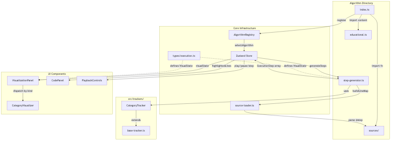
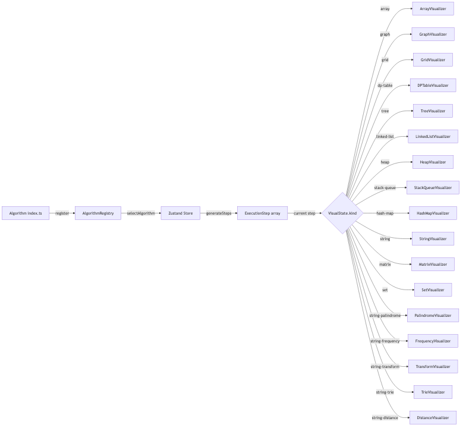
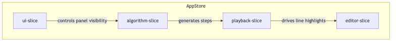

[← Back to README](../README.md)

# Architecture

AlgoFlow uses a **registry-driven** architecture with **pre-computed execution steps**. This document covers the technical design: how algorithms are registered, how steps are generated, how state flows through the app, and how the UI renders visualizations.

> [!NOTE] > **Prerequisites:** See the [Glossary](glossary.md) for definitions of key terms like ExecutionStep, VisualState, Tracker, and LineMap.

## Contents

- [Development System](#development-system)
- [Tech Stack](#tech-stack)
- [Data Flow](#data-flow)
- [Core Pattern](#core-pattern)
- [State Management](#state-management)
- [Custom Hooks](#custom-hooks)
- [Responsive Design](#responsive-design)
- [Input Editors](#input-editors)
- [Educational Drawer](#educational-drawer)
- [Project Structure](#project-structure)

## Development System

The `.claude/` directory defines agents, skills, session hooks, and plugins for development workflow automation and quality enforcement. See [Development System](claude-system.md) for the full reference.

---

## Tech Stack

| Layer       | Technology                             | Purpose                                              |
| ----------- | -------------------------------------- | ---------------------------------------------------- |
| Framework   | Vite + React 19 + TypeScript (strict)  | Build tooling, UI, type safety                       |
| Styling     | Tailwind CSS v4 + 2-layer CSS tokens   | Dark/light theme support with @theme + @layer base   |
| State       | Zustand (4 slices + immer)             | Global state management                              |
| Code Editor | Monaco Editor                          | Read-only code display with line highlighting        |
| Layout      | react-resizable-panels                 | 3-panel desktop, 2-panel tablet, single-panel mobile |
| Animation   | Framer Motion                          | Bar swaps, grid waves, spring transitions            |
| Testing     | Vitest + Testing Library + Storybook 8 | Unit, visual, and integration testing                |

## High-Level Code Architecture

How critical files connect across the system — from algorithm registration through step generation to visual rendering:



### Reading the Diagram

| Layer | What It Does |
|-------|-------------|
| **Algorithm Directory** | Each algorithm has `index.ts` (registration), `step-generator.ts` (step production), `educational.ts` (learning content), and `sources/` (6-language implementations) |
| **Trackers** | `CategoryTracker` extends `BaseTracker` to provide domain-specific methods (compare, swap, visit) that build `ExecutionStep` objects |
| **Core Infrastructure** | `AlgorithmRegistry` holds all registered algorithms. `Zustand Store` manages state. `source-loader.ts` parses `@step:` annotations into line maps |
| **UI Components** | `VisualizationPanel` dispatches to the correct `CategoryVisualizer` based on `visualState.kind`. `CodePanel` highlights lines. `PlaybackControls` manages step navigation |

## Data Flow



## Core Pattern

1. Each algorithm **self-registers** via `registry.register(definition)` at import time
2. `generateSteps(input)` produces a full `ExecutionStep[]` array eagerly
3. **Playback is an index pointer** into the step array — instant scrubbing, deterministic replay
4. Category-specific **trackers** build steps with correct visual state and per-language line mappings
5. A **discriminated union** on `VisualState.kind` dispatches to the matching visualizer component

> [!NOTE]
> All UI components are generic — no algorithm-specific logic in the view layer. Adding a new algorithm requires zero changes to any component.

### ExecutionStep

The central data type for playback. Each step is an immutable snapshot:

| Field              | Type                      | Purpose                                       |
| ------------------ | ------------------------- | --------------------------------------------- |
| `index`            | `number`                  | Position in the step array                    |
| `type`             | `StepType`                | Categorizes the step for line-map resolution  |
| `description`      | `string`                  | Human-readable text for the explanation panel |
| `highlightedLines` | `LineHighlight[]`         | Per-language source lines to highlight        |
| `variables`        | `Record<string, unknown>` | Runtime variable snapshot at this step        |
| `visualState`      | `VisualState`             | Discriminated union consumed by visualizers   |
| `metrics`          | `StepMetrics`             | Cumulative operation counts                   |

Defined in `src/types/execution.ts`.

### Trackers

Each algorithm category has a dedicated tracker that extends `BaseTracker`. Trackers provide domain-specific methods (e.g., `compare`, `swap` for sorting) that internally call `pushStep()` to record an `ExecutionStep` with the correct visual state.

`SortingTracker` has an additional method beyond the standard set:

| Method                           | Purpose                                                                                                      |
| -------------------------------- | ------------------------------------------------------------------------------------------------------------ |
| `setElementValue(index, value)`  | Syncs the tracker's internal array state after a non-swap mutation (e.g., placing a value at a specific position during distribution sorts or insertion). Use this when writing to an index directly rather than swapping two elements. |

All trackers extend `BaseTracker` (`src/trackers/base-tracker.ts`), which provides:

| Member            | Visibility  | Purpose                                                  |
| ----------------- | ----------- | -------------------------------------------------------- |
| `pushStep(input)` | `protected` | Records an `ExecutionStep` with resolved line highlights |
| `getSteps()`      | `public`    | Returns the accumulated `ExecutionStep[]`                |
| `getMetrics()`    | `public`    | Returns a snapshot of cumulative `StepMetrics`           |
| `lineMap`         | `protected` | Maps step keys to per-language line numbers              |
| `metrics`         | `protected` | Running operation counts (comparisons, swaps, etc.)      |

Constructor: `new BaseTracker(lineMap: LineMap)` where `LineMap = Record<string, Record<SupportedLanguage, number[]>>`.

See [contributing.md](contributing.md#available-trackers) for the full tracker table with methods per category.

### Source Files & Line Mapping

Algorithm source files (`sources/*.ts`, `*.py`, `*.java`, `*.rs`, `*.cpp`, `*.go`) support two Vite import suffixes — `?raw` for Monaco display and `?fn` for executable tests. The `?fn` suffix is powered by `vite-plugin-fn-import.ts` at the project root, a custom Vite plugin that strips `@step:` markers and transpiles TypeScript source files into executable ESM modules.

The `buildLineMapFromSources(algorithmId)` utility (`src/utils/source-loader.ts`) parses `@step:` markers from all language source files for a given algorithm and returns a `LineMap` mapping each step key to per-language line numbers. Step generators pass this to their tracker constructor.

`discoverTechniqueLabels()` (also in `src/utils/source-loader.ts`) auto-discovers technique display labels by scanning the algorithm directory structure at build time. Technique labels are no longer hardcoded — they are derived directly from the filesystem, so adding a new technique directory automatically produces a label in the algorithm selector's two-level hierarchy without any manual registration.

See the [full annotation guide](contributing.md#the-step-annotation-system) and [import conventions](contributing.md#step-1-write-the-source-files) in the contributing docs.

## State Management

Zustand with 4 slices merged into a single `AppStore`, using immer middleware for immutable updates:

| Slice         | Owns                                              | Key Actions                                                |
| ------------- | ------------------------------------------------- | ---------------------------------------------------------- |
| **algorithm** | Selected algorithm, input data, grid state        | `selectAlgorithm`, `updateInput`, `updateGrid`             |
| **playback**  | Current step index, play/pause, speed, step array | `play`, `pause`, `stepForward`, `stepBackward`, `setSpeed` |
| **editor**    | Monaco editor ref, selected language              | `setLanguage`, `setEditorRef`                              |
| **UI**        | Drawer visibility, panel sizes, theme, mobile tab | `toggleDrawer`, `setActiveTab`, `setTheme`, `toggleTheme`  |

> [!NOTE]
> `selectAlgorithm()` and `recompute()` atomically reset `currentStepIndex: 0` and `isPlaying: false` in the same store update as the step array replacement. This prevents a frame where the old step index exceeds the new step array length.



Access state in components via:

```typescript
const isPlaying = useAppStore((state) => state.isPlaying);
const selectAlgorithm = useAppStore((state) => state.selectAlgorithm);
```

## Responsive Design

| Tier        | Breakpoint   | Layout                                                             |
| ----------- | ------------ | ------------------------------------------------------------------ |
| **Desktop** | >= 1024px    | 3-panel resizable layout (code, visualization, explanation)        |
| **Tablet**  | 768 – 1023px | 2-panel resizable layout (visualization + Steps/Code tab switcher) |
| **Mobile**  | < 768px      | Tab-based single-panel switcher (compact controls)                 |

Breakpoint values are defined in `BREAKPOINTS` (`src/utils/constants.ts`). Layout switching uses `useResponsiveLayout` which returns a `LayoutTier` (`"mobile" | "tablet" | "desktop"`) via `useSyncExternalStore` for tear-free viewport-aware rendering.

## Input Editors

The `InputEditor` component is split into 10 focused files, each handling a specific input shape:

| File                      | Handles                                                                 |
| ------------------------- | ----------------------------------------------------------------------- |
| `ArrayInputEditor.tsx`    | Comma-separated arrays (sorting, heaps, linked lists). Debounced `onChange` fires on every keystroke (300ms) and a `useEffect` resyncs when the algorithm switches. |
| `SearchingInputEditor.tsx`| Sorted array + target value                                              |
| `StringInputEditor.tsx`   | Text string + pattern string                                             |
| `MatrixInputEditor.tsx`   | Textarea (one row per line, comma-separated)                             |
| `KmpSearchInputEditor.tsx`| KMP-specific string and pattern inputs                                   |
| `GenericEditor.tsx`       | Auto-generated editor for DP and other categories (introspects `defaultInput` shape) |

Each algorithm category has a tailored input editor rendered above the visualization:

| Category            | Input Type                                                                                                                                                            |
| ------------------- | --------------------------------------------------------------------------------------------------------------------------------------------------------------------- |
| Sorting             | Comma-separated array                                                                                                                                                 |
| Searching           | Sorted array + target value                                                                                                                                           |
| Arrays              | Array (+ optional params: window size, target, K, etc.)                                                                                                               |
| Dynamic Programming | Generic editor auto-generated from `defaultInput` shape (number scalars, number arrays, string fields, string arrays) — no custom editor needed for new DP algorithms |
| Pathfinding         | Interactive mini-grid (click walls, drag start/end, reset)                                                                                                            |
| Heaps               | Comma-separated array                                                                                                                                                 |
| Linked Lists        | Comma-separated values                                                                                                                                                |
| Stacks & Queues     | Bracket string                                                                                                                                                        |
| Hash Maps           | Array + target number                                                                                                                                                 |
| Strings             | Text string + pattern string                                                                                                                                          |
| Matrices            | Textarea (one row per line, comma-separated)                                                                                                                          |
| Sets                | Two comma-separated arrays (A and B)                                                                                                                                  |
| Trees               | No input editor — tree structure is fixed per algorithm                                                                                                               |

> [!IMPORTANT]
> All input edits are **temporary and non-persistent**. Edits reset on algorithm switch or page reload. No localStorage, URL state, or server persistence.

## Educational Drawer

A slide-over drawer (toggled via "L" key or header button) displays 7 sections of learning content per algorithm: Overview, How It Works, Time & Space Complexity, Best & Worst Case, Real-World Uses, Strengths & Limitations, When to Use It.

## Custom Hooks

| Hook                   | Purpose                                                                                                                |
| ---------------------- | ---------------------------------------------------------------------------------------------------------------------- |
| `usePlaybackEngine`    | Manages play/pause interval, speed changes, and timed step advancement                                                 |
| `useKeyboardShortcuts` | Binds global keyboard events to playback and UI actions                                                                |
| `useResponsiveLayout`  | Returns `LayoutTier` ("mobile" \| "tablet" \| "desktop") via `useSyncExternalStore` for breakpoint-based layout shifts |

All hooks are in `src/hooks/`.

## Architectural Decisions & Trade-offs

The "Why" behind the structural engineering.

### 1. Why a Registry Pattern?

Instead of tightly coupling UI components (like a hardcoded sidebar) to specific algorithm files via static imports, AlgoFlow inversion-of-control relies entirely on self-registration.

- **Trade-off:** It forces a stricter interface constraint on the algorithm definitions. If a definition is incomplete, the app might crash at runtime instead of failing TypeScript compilations gracefully at the root UI layer.
- **Why we did it anyway:** It decouples navigation, filtering, and component rendering completely from logic execution. A new developer can add 50 new algorithms without touching a single React UI file.

### 2. Why Pre-Computed Steps instead of Generators?

Pre-computing all steps into an array uses more memory than lazy generators, but enables instant backward/forward scrubbing — users can "time-travel" through any step like a video timeline. Generators block backward traversal.

### 3. Why Zustand Slices over Redux or React Context?

Zustand avoids Redux's boilerplate overhead and React Context's full-subtree re-rendering on any state change. Zustand allows atomic subscription to individual fields (e.g., `currentStepIndex` updating at 100ms intervals without re-rendering unrelated components).

## Current Constraints & Future Improvements

1. **Main-thread step calculation** — `generateSteps` runs synchronously; complex algorithms can freeze the UI. Bounded by `MAX_STEPS = 10000`. Future: offload to Web Worker.
2. **Tracker imperative coupling** — Tracker subclasses mutate state and push steps in one call. Future: functional reducer `(prevState, action) => nextState` for easier testing.
3. **Monaco on mobile** — Monaco struggles with soft keyboards on iOS/Android. Future: swap for a lightweight read-only highlighter on mobile.

## Project Structure

> [!NOTE]
> All UI is generic — algorithm-specific logic lives exclusively in `src/algorithms/` and `src/trackers/`.

```
.claude/
├── agents/                  # Subagent role definitions
├── hooks/                   # Session hook scripts
├── skills/                  # Reusable prompt skill modules
└── rules/                   # Coding standards, architecture constraints, workflow rules
e2e/                         # E2E browser tests (Playwright)
docs/                        # Documentation
src/
├── algorithms/              # Self-registering algorithm definitions
│   │                        # All categories use category/technique/algorithm/ nesting
│   │                        # Per-algorithm directory layout:
│   │                        #   index.ts, step-generator.ts, educational.ts
│   │                        #   sources/          (6-language source implementations)
│   │                        #   __tests__/         (all tests + pipeline story)
│   ├── sorting/             # e.g. sorting/comparison/bubble-sort/
│   ├── searching/           # e.g. searching/binary/binary-search/
│   ├── graph/               # e.g. graph/traversal/bfs/
│   ├── pathfinding/         # e.g. pathfinding/shortest-path/dijkstra/
│   ├── dynamic-programming/ # e.g. dynamic-programming/1d-linear/fibonacci-tabulation/
│   ├── arrays/              # e.g. arrays/sliding-window/max-sum-subarray/
│   ├── trees/               # e.g. trees/bst-operations/bst-search/
│   ├── linked-lists/        # e.g. linked-lists/manipulation/reverse-linked-list/
│   ├── heaps/               # e.g. heaps/construction/build-min-heap/
│   ├── stacks-queues/       # e.g. stacks-queues/validation/valid-parentheses/
│   ├── hash-maps/           # e.g. hash-maps/lookup/two-sum/
│   ├── strings/             # e.g. strings/pattern-matching/kmp-search/
│   ├── matrices/            # e.g. matrices/traversal/spiral-order/
│   └── sets/                # e.g. sets/operations/set-intersection/
├── components/
│   ├── code-panel/          # Monaco editor with language tabs
│   ├── educational/         # Slide-over educational drawer
│   ├── explanation-panel/   # Step details, metrics, variables
│   ├── input-editor/        # Category-specific input editors
│   ├── layout/              # AppShell, Header, DesktopLayout, TabletLayout, MobileLayout
│   ├── playback/            # PlaybackControls with progress bar
│   ├── shared/              # Button, Badge, IconButton, Select
│   └── visualization/       # VisualizationPanel dispatch + category subdirectories
│       ├── arrays/          #   ArrayVisualizer
│       ├── dynamic-programming/ # DPTableVisualizer
│       ├── graph/           #   GraphVisualizer, GridVisualizer
│       ├── hash-maps/       #   HashMapVisualizer
│       ├── heaps/           #   HeapVisualizer
│       ├── linked-lists/    #   LinkedListVisualizer
│       ├── matrices/        #   MatrixVisualizer
│       ├── sets/            #   SetVisualizer
│       ├── stacks-queues/   #   StackQueueVisualizer
│       ├── strings/         #   StringVisualizer + 5 specialized (Palindrome, Trie, etc.)
│       └── trees/           #   TreeVisualizer
├── hooks/                   # usePlaybackEngine, useKeyboardShortcuts, useResponsiveLayout
├── registry/                # AlgorithmRegistry singleton
├── store/                   # Zustand slices (algorithm, playback, editor, UI)
├── trackers/                # Category-specific step trackers in category subdirectories
│   ├── base-tracker.ts      #   Shared base class
│   ├── arrays/              #   SortingTracker, SearchingTracker, ArrayTracker
│   ├── dynamic-programming/ #   DPTracker
│   ├── graph/               #   GraphTracker, PathfindingTracker
│   ├── hash-maps/           #   HashMapTracker
│   ├── heaps/               #   HeapTracker
│   ├── linked-lists/        #   LinkedListTracker
│   ├── matrices/            #   5 matrix trackers
│   ├── sets/                #   5 set trackers
│   ├── stacks-queues/       #   4 stack/queue trackers
│   ├── strings/             #   6 string trackers
│   └── trees/               #   6 tree trackers
├── types/                   # TypeScript type definitions
└── utils/                   # Constants, source file loader
```

### Algorithm Directory Layout

Each algorithm directory follows this structure:

```
src/algorithms/<category>/<technique>/<algorithm>/
├── index.ts                 # AlgorithmDefinition + registry.register()
├── step-generator.ts        # Produces ExecutionStep[] using a tracker
├── educational.ts           # 7 learning content sections
├── sources/                 # 6-language source implementations
│   ├── <algorithm>.ts       #   TypeScript with @step: markers
│   ├── <algorithm>.py       #   Python
│   ├── <Algorithm>.java     #   Java
│   ├── <algorithm>.rs       #   Rust
│   ├── <Algorithm>.cpp      #   C++
│   └── <algorithm>.go       #   Go
└── __tests__/               # All tests and pipeline story
    ├── <algorithm>.test.ts  #   TypeScript correctness tests
    ├── step-generator.test.ts  # Step generation tests
    ├── <Algorithm>Pipeline.stories.tsx  # Storybook pipeline story
    ├── <algorithm>_test.py  #   Python tests
    ├── <Algorithm>_test.java #  Java tests
    ├── <algorithm>_test.rs  #   Rust tests
    ├── <Algorithm>_test.cpp #   C++ tests
    └── <algorithm>_test.go  #   Go tests
```

---

## See Also

- [Onboarding Guide](onboarding.md) — the critical starting point for all new developers
- [Glossary](glossary.md) — key terms and type definitions
- [Contributing](contributing.md) — adding algorithms, trackers, languages, and troubleshooting
- [Testing](testing.md) — unit tests, E2E, Storybook, Chromatic
- [Deployment](deployment.md) — Docker, CI/CD pipelines
- [Design System](design-system.md) — colors, typography, breakpoints, accessibility
- [Development System](claude-system.md) — agents, skills, hooks, plugins
