[← Back to README](../README.md)

# Debugging Guide

This guide covers the most common failure modes in AlgoFlow and how to fix them quickly. Each section maps a symptom to a root cause and provides a concrete debug pattern you can run immediately.

> **Prerequisites:** Read [Architecture](architecture.md) (data flow, core pattern) and [Glossary](glossary.md) (key terms) first. The sections below assume familiarity with the registry, tracker abstraction, and `ExecutionStep` shape.

## Contents

- [Quick Diagnosis Table](#quick-diagnosis-table)
- [Step Generation Failures](#step-generation-failures)
- [Line Mapping Issues](#line-mapping-issues)
- [Visualizer Rendering Problems](#visualizer-rendering-problems)
- [?fn Import Pipeline](#fn-import-pipeline)
- [Registry & Self-Registration](#registry--self-registration)
- [Tree-Specific Debugging](#tree-specific-debugging)
- [E2E Test Failures](#e2e-test-failures)
- [See Also](#see-also)

---

## Quick Diagnosis Table

| Symptom                | Likely Cause                                     | Section                                                         |
| ---------------------- | ------------------------------------------------ | --------------------------------------------------------------- |
| Algorithm not in UI    | Missing import in `src/algorithms/index.ts`      | [Registry & Self-Registration](#registry--self-registration)    |
| Wrong line highlighted | `@step:` key mismatch between source and tracker | [Line Mapping Issues](#line-mapping-issues)                     |
| Blank visualizer       | `VisualState.kind` doesn't match any visualizer  | [Visualizer Rendering Problems](#visualizer-rendering-problems) |
| Step count is 0        | Tracker not calling `pushStep()`                 | [Step Generation Failures](#step-generation-failures)           |
| `?fn` import error     | File not in `sources/` directory or not `.ts`    | [?fn Import Pipeline](#fn-import-pipeline)                      |
| E2E test timeout       | `webServer` failed to start or wrong port        | [E2E Test Failures](#e2e-test-failures)                         |

---

## Step Generation Failures

`generateSteps()` returns an empty array (or fewer steps than expected) when the tracker's `pushStep()` is never called, called with wrong arguments, or when the algorithm logic exits early.



**Common causes:**

- Tracker method is never reached — the algorithm logic has a guard clause or early return that prevents execution
- `complete()` is not called at the end — the final step (marking the algorithm as done) is missing
- Wrong tracker class for the category — for example, using `SortingTracker` inside a graph algorithm

**Debug pattern:** In a unit test, call `generateSteps()` with a known minimal input and log the step count and types:

```ts
const steps = generateSteps(knownInput);
console.log(steps.length);
console.log(steps.map((step) => step.type));
```

If the array is empty, add a `console.log` immediately before the first `pushStep()` call in the tracker to confirm execution reaches that point.

---

## Line Mapping Issues

Lines in the code panel are highlighted based on a `LineMap` built from `@step:` marker comments in each source file. A mismatch between the marker key and the step type causes no lines (or the wrong lines) to highlight.



**Common causes:**

- The step key in a source file (`// @step:compare`) doesn't match the `type` or `lineMapKey` passed to the tracker call — even a small typo (e.g., `comparee`) silently produces no highlight
- Language files use different step keys — keys must be identical across TypeScript, Python, Java, Rust, C++, and Go source files
- A `@step:` marker is missing entirely for a step type — that step will produce no highlighted lines

**Debug pattern:** Call `buildLineMapFromSources(algorithmId)` in a test and inspect the output to verify all expected keys are present with correct line numbers for every language:

```ts
const lineMap = buildLineMapFromSources("bubble-sort");
console.log(JSON.stringify(lineMap, null, 2));
```

Cross-reference each key in the map against the step `type` values produced by `generateSteps()`.

---

## Visualizer Rendering Problems

The visualization panel renders nothing (blank panel) when the `VisualState.kind` produced by the tracker does not match any registered visualizer.

**Valid `kind` values** — see the full `VisualState` discriminated union in [Glossary — VisualState](glossary.md#visualstate). Common kinds: `array`, `graph`, `grid`, `dp-table`, `tree`, `linked-list`, `heap`, `stack-queue`, `hash-map`, `string`, `matrix`, `set`.

**Common causes:**

- Returning a `kind` that is misspelled or not in the union (TypeScript strict mode should catch this at compile time, but a cast can bypass it)
- Copying a tracker from a different category and forgetting to change the `kind` field
- The visualizer switch/dispatch has not been updated to handle a newly added `kind`

**Debug pattern:** Log the `visualState.kind` of each step:

```ts
const steps = generateSteps(knownInput);
steps.forEach((step) => console.log(step.visualState.kind));
```

---

## ?fn Import Pipeline

The `?fn` query suffix is handled by the custom Vite plugin (`vite-plugin-fn-import.ts`). It allows algorithm source files to be imported as executable JavaScript functions while stripping visualization markers at build time.

**How it works:**

1. Intercepts any import ending in `?fn`
2. Reads the `.ts` source file from disk
3. Strips all `// @step:` markers via regex so the output is clean code
4. Transpiles TypeScript to JavaScript via OxC
5. Auto-exports all top-level `function` declarations

**Key constraints:**

- Only works for `.ts` files — `.py` and `.java` files are not transpilable by this plugin
- The file must live inside a `sources/` directory within the algorithm directory
- If the file cannot be read (wrong path, wrong extension), the plugin silently returns `null`, which manifests as a module-not-found error at runtime

**Debug pattern:** If a `?fn` import fails, verify:

1. The imported path points to a `.ts` file (not `.js`, `.py`, or `.java`)
2. That file lives under a `sources/` subdirectory of the algorithm
3. The file contains at least one top-level `function` declaration (arrow functions assigned to `const` are not auto-exported)

---

## Registry & Self-Registration

Each algorithm registers itself by calling `registry.register(definition)` when its `index.ts` module is imported. If the module is never imported, the algorithm silently never appears in the UI.

**How it works:**

1. `src/algorithms/index.ts` imports each algorithm's `index.ts` (barrel imports)
2. The import triggers module evaluation, which calls `registry.register(definition)`
3. The registry stores the definition and makes it available to all UI components

**Common issues:**

- **Missing import in `src/algorithms/index.ts`** — most common cause of an algorithm not appearing in the dropdown; add the import to fix it
- **Duplicate `meta.id`** — `registry.register()` throws if an algorithm with the same ID is already registered; check for copy-paste errors when adding a new algorithm
- **Wrong category string** — the algorithm is registered but appears under the wrong dropdown section

**Debug pattern:** Check `src/algorithms/index.ts` for the import. Then confirm the `register` call exists in the algorithm's own `index.ts`:

```sh
grep -r "registry.register" src/algorithms/
```

Verify the `meta.id` is unique across all algorithm definitions.

---

## Tree-Specific Debugging

Tree algorithms use the `tree` VisualState kind and have several fields that require extra attention:

### Dual-tree algorithms (`secondaryTree`)

Some tree algorithms (e.g., LCA, symmetric tree check) operate on two trees simultaneously. These algorithms populate a `secondaryTree` field alongside the primary `nodes` and `edges` arrays. If the secondary tree renders blank, verify that `secondaryTree` is set on every step — omitting it on even one step causes the secondary panel to disappear mid-playback.

### N-ary tree support (`childrenIds`)

Each `TreeNode` carries a `childrenIds` array listing the IDs of its children. Binary tree algorithms always produce exactly 0, 1, or 2 entries. N-ary algorithms (tries, segment trees, expression trees) may produce many. If a child node renders disconnected from its parent, check that the parent's `childrenIds` includes the child's ID and that the child appears in the `nodes` array.

**Debug pattern:**

```ts
const steps = generateSteps(knownInput);
const step = steps[0];
if (step.visualState.kind === "tree") {
  step.visualState.nodes.forEach((node) => {
    console.log(node.id, "->", node.childrenIds);
  });
}
```

### Segment tree queries (`queryRange`)

Segment tree algorithms expose a `queryRange` field `[left, right]` on the `tree` VisualState to indicate the active query interval. If highlighted nodes do not match the expected range, confirm that `queryRange` is updated correctly each time the active segment changes.

---

## E2E Test Failures

The E2E suite uses `@playwright/test`. Spec files live in `e2e/specs/`, config at `e2e/playwright.config.ts`. The `webServer` block auto-starts Vite on port 5174 so no manual dev server is needed.

**How the suite runs:**

- `npm run e2e` — headless mode (CI / automated)
- `npm run e2e:headed` — opens a visible browser for interactive debugging
- `npm run e2e:debug` — opens the Playwright inspector for step-through debugging
- The `session-end-e2e-check.sh` Stop hook runs the suite automatically whenever `.tsx`, `.css`, `.html`, or `e2e/specs/` files are modified

**Common failures and fixes:**

| Failure                            | Cause                                                                                                    | Fix                                                                                                              |
| ---------------------------------- | -------------------------------------------------------------------------------------------------------- | ---------------------------------------------------------------------------------------------------------------- |
| Element not found / selector error | A component's DOM structure or ARIA label changed                                                        | Update the selector in the relevant spec file or shared helper in `e2e/helpers/` to match the new structure      |
| Timeout waiting for element        | Slow step generation or animation blocking the assertion                                                 | Increase the wait timeout for that assertion, or check that `generateSteps()` completes without hanging          |
| Console error detected             | Runtime JS error on the page (the suite monitors for errors, filtering ResizeObserver and favicon noise) | Open the browser console with `npm run e2e:headed` and fix the underlying error                                  |
| New algorithm not tested           | Algorithm added to registry but category spec file doesn't pick it up                                    | Per-category spec files auto-discover from the registry — verify `src/algorithms/index.ts` imports the algorithm |
| Wrong port / connection refused    | `webServer` config failed to start Vite                                                                  | Check port 5174 is free; re-run `npm run e2e` — `webServer` handles startup automatically                        |

**Debug tips:**

- Run `npm run e2e:headed` to watch every step execute in a real browser
- Run `npm run e2e:debug` to pause and inspect the DOM at any assertion
- Confirm Node version is 22: `node --version`
- Clear Playwright cache if selectors behave unexpectedly: `npx playwright install chromium`

---

For additional common pitfalls, see [Common Pitfalls & Troubleshooting](contributing.md#common-pitfalls--troubleshooting).

---

## See Also

- [Contributing](contributing.md) — branch workflow, algorithm walkthrough, common pitfalls & troubleshooting
- [Architecture](architecture.md) — core registry-driven pattern, tracker abstraction, data flow
- [Glossary](glossary.md) — definitions for `ExecutionStep`, `VisualState`, `LineMap`, tracker, and other key terms
